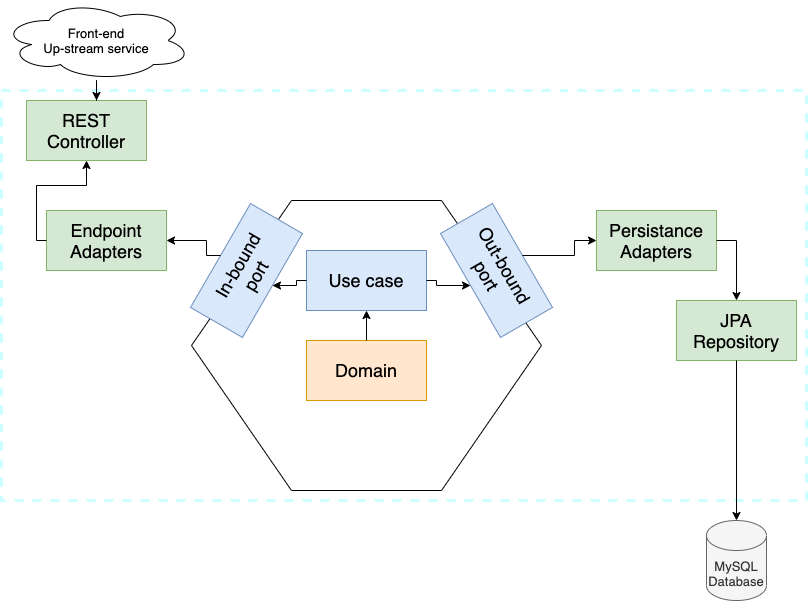

# rest-spring-boot-hexagonal-architecture

This project is to expose my interpretation of the hexagonal architecture, under spring-boot framework.

The diagram of the hexagonal architecture relies on the following:


I have tried to take a diagram that I have seen common on different articles, even though I saw port/adapter to be swap.

This architecture follows the clean architecture from Uncle bob:

[https://blog.cleancoder.com/uncle-bob/2012/08/13/the-clean-architecture.html](https://blog.cleancoder.com/uncle-bob/2012/08/13/the-clean-architecture.html)

This project is following this diagram on spring-boot framework.

## Application diagrams

On this I was doing the following approach diagram:



Where we have as part of the application is:

- REST implementation
- Database connection

The colors meant to be:

- Orange: this is the domain model of our application, that is located on `com.example.service.user.domain`
- Blue: this is the application itself, where we have the logic and the ports (to apply this logic from and to). The package is: `com.example.service.user.application`
- Green: this is the package `com.example.service.user.adapter`, where are the implementation of the ports. It was decided to keep the repositories and the controllers, even though this could be moved to the `infrastructure` package.

What was not played out on this diagram was the package:

`com.example.service.user.infrastructure`

This package is cross, so it was not having a flow on the diagram, but impacts to be defined shared components.

## Domain model

The domain model is a simple one, for user management.

This diagram it is just a simple information for eventual `User` domain. We can see the following domain model diagram:


where the colors here represents:

- Orange: entity or root aggregate of our domain
- Blue: value objects

This domain has a functions class, where it is a bunch of functions to access to `User` entity information.

## Architecture tests

It was implemented the arch rules from [arch unit library](https://www.archunit.org/).

The tests are located on:

```text
com.example.service.user.architecture.*
```

## Test strategy

The tests develop were doing unit tests for each class of the project.

Do integration test on the controller, which is our application entry point.

## Reactive strategy

In order to have not coupling with the spring boot reactive approach, it was defined two wrappers:

- `com.example.service.user.infrastructure.reactive.CollectionReactive`: wrapper of the `Flux` object from reactive spring (reactor) approach.
- `com.example.service.user.infrastructure.reactive.UnitReactive`: wrapper of the `Mono` object from reactive spring (reactor) approach.

These objects are used in the application level, to control the access to the reactive objects.

There is a problem when requiring transaction, where `@Transactional` cannot be used, as Flux/Mono are not being used. To have transactions we can use:

```text
org.springframework.transaction.reactive.TransactionalOperator
```

We can see its use on the test:

```text
com.example.service.user.adapter.entrypoint.api.UserControllerIntegrationTest
com.example.service.user.adapter.persistence.UserRepositoryTest
```